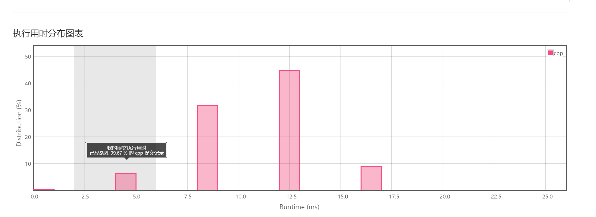
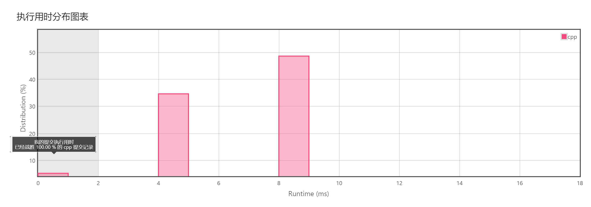

# Task02

**1. 合并两个有序链表**

```c++
/**
 * Definition for singly-linked list.
 * struct ListNode {
 *     int val;
 *     ListNode *next;
 *     ListNode(int x) : val(x), next(NULL) {}
 * };
 */
class Solution {
public:
    ListNode* mergeTwoLists(ListNode* l1, ListNode* l2) {
        ListNode* head = new ListNode(0);
        ListNode* L = head;
        while(l1 != NULL || l2 != NULL){
               if(l1 != NULL && l2 != NULL){
                   if(l1->val > l2->val){
                       L->next = l2;
                       l2 = l2->next;
                   }
                    else{
                        L->next = l1;
                        l1 = l1->next;
                    }
               } 
               else if( l2 == NULL && l1 != NULL){
                   L->next = l1;
                   l1 = l1->next;
               }
               else if( l1 == NULL && l2 != NULL){
                   L->next = l2;
                   l2 = l2->next;
               }
               L = L->next;
        }
        return head->next;
    }
};
```



**2. 删除链表的倒数第N个节点**

```c++
   class Solution {
    public:
        ListNode* removeNthFromEnd(ListNode* head, int n) {
            ListNode* cur = head;
            ListNode* p = new ListNode(0);
            p->next = head; 
            int len = 0;
            while(cur != NULL){
                len++;
                cur = cur->next;    
            }
            cur = p;
            len -= n;
            while(len > 0)
            {
                len--;
                cur = cur->next;
            }
            cur->next = cur->next->next;
            return p->next;  
        }
    };
```



**3. 旋转链表**

```c++
/**
 * Definition for singly-linked list.
 * struct ListNode {
 *     int val;
 *     ListNode *next;
 *     ListNode(int x) : val(x), next(NULL) {}
 * };
 */
class Solution {
public:
    ListNode* rotateRight(ListNode* head, int k) {
        ListNode* p = head;
        int length = 0;
        while(p){
            length++;
            p = p->next;
        }
        if(length == 0 || k%length == 0)    return head;
        p = head;
        int lenk = length - (k%length) - 1;
        while((lenk--) > 0) p = p->next;
        ListNode* q = p->next;
        p->next = NULL;
        p = head;
        head = q;
        while(q->next)  q = q->next;
        q->next = p;
        return head;
    }
};
```


