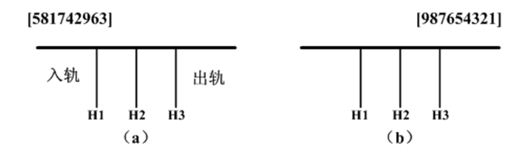
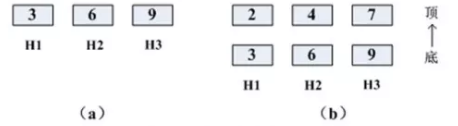

# task03 栈与递归

---

## 车辆重排问题

根据要求完成车辆重排的程序代码

假设一列货运列车共有`n`节车厢，每节车厢将停放在不同的车站。假定`n`个车站的编号分别为`1`至`n`，货运列车按照第`n`站至第`1`站的次序经过这些车站。车厢的编号与它们的目的地相同。为了便于从列车上卸掉相应的车厢，必须重新排列车厢，使各车厢从前至后按编号`1`至`n`的次序排列。当所有的车厢都按照这种次序排列时，在每个车站只需卸掉最后一节车厢即可。

我们在一个转轨站里完成车厢的重排工作，在转轨站中有一个入轨、一个出轨和`k`个缓冲铁轨（位于入轨和出轨之间）。图（a）给出一个转轨站，其中有`k`个（`k=3`）缓冲铁轨`H1`，`H2` 和`H3`。开始时，`n`节车厢的货车从入轨处进入转轨站，转轨结束时各车厢从右到左按照编号`1`至`n`的次序离开转轨站（通过出轨处）。在图（a）中，`n=9`，车厢从后至前的初始次序为`5，8，1，7，4，2，9，6，3`。图（b）给出了按所要求的次序重新排列后的结果。

图1



(1)问题分析

现在分析图 1，为了重排车厢，需从前至后依次检查入轨上的所有车厢：

- 如果正在检查的车厢就是下一个满足排列要求的车厢，可以直接把它放到出轨上去；
- 如果不是，则把它移动到缓冲铁轨上，直到按输出次序要求轮到它时才将它放到出轨上；
- 缓冲铁轨上车厢的进和出只能在缓冲铁轨的尾部进行。

在重排车厢过程中，仅允许以下移动:

1、车厢可以从入轨移动到一个缓冲铁轨的尾部或进入出轨接在重排的列车后。

2、车厢可以从一个缓冲铁轨的尾部移动到出轨接在重排的列车后。

考察图1 (a)， 3 号车厢在入轨的前部，但由于它必须位于 1 号和 2 号车厢的后面，因此不能立即输出 3 号车厢，可把 3 号车厢送入缓冲铁轨 H1。

下一节车厢是 6 号车厢，也必须送入缓冲铁轨。如果把 6 号车厢送入 H1，那么重排过程将无法完成，因为 3 号车厢位于 6 号车厢的后面，而按照重排的要求，3 号车厢必须在 6 号车厢之前输出。因此可把 6 号车厢送入 H2。

下一节车厢是 9 号车厢，被送入 H3，因为如果把它送入 H1 或 H2，重排过程也将无法完成。

至此，缓冲铁轨的当前状态如图 2 (a) 所示。



接下来处理 2 号车厢，它可以被送入任一一个缓冲铁轨，因为它能满足**缓冲铁轨上车厢编号必须递增排列**的要求，不过，应优先把 2 号车厢送入 H1，因为如果把它送入 H3 ,将没有空间来移动 7 号车厢和 8 号车厢。如果把 2号车厢送入 H2,那么接下来的 4 号车厢必须被送入 H3，这样将无法移动后面的 5 号、7 号和 8 号车厢。

新的车厢 u 应送入这样的缓冲铁轨：

其底部的车厢编号 v 满足 `v>u`，且 v 是所有满足这种条件的缓冲轨顶部车厢编号中最小的一个编号。只有这样才能使后续的车厢重排所受到的限制最小。

接下来处理 4 号车厢时，三个缓冲铁轨顶部的车厢分别为 2 号、6 号、9 号车厢。根据分配规则，4 号车厢应送入H2。

这之后，7 号车厢被送入 H3。图2 (b) 给出了当前的状态。

接下来，1 号车厢被送至出轨，这时，可以把 H1 中的 2 号车厢送至出轨。

之后，从 H1 输出 3 号车厢，H2 输出 4 号车厢。

至此，没有可以立即输出的车厢了。

接下来的 8 号车厢被送入 H1，然后 5 号车厢从入轨处直接输出到出轨处。这之后，从 H2 输出 6 号车厢，从 H3输出 7 号车厢，从 H1 输出 8 号车厢，最后从 H3 输出 9 号车厢。到此为止，“出轨”完毕！

让我们整理一下算法思路：

- 第一步：若需出轨的编号恰是入轨编号，则直接出轨；
- 第二步：若需出轨的编号恰是缓冲轨的最小编号，则直接出轨；
- 第三步：将入轨编号放入缓冲轨。（**规则：放到满足小于缓冲轨栈顶元素编号且栈项元素最小的上面**。)

(2)代码实现

```c++
#include <iostream>
#include <stack>
#include <string>
#include <vector>
using namespace std;

int minS;//最少的栈数
int n;//车厢节数
vector< stack<int>> stk;//记录重排所使用的栈
stack<int> dest;//目标栈
vector<int> path;//记录最佳重排的步骤

void print()//输出最佳重排的步骤
{
    for(int i=0;i!=path.size();i+=3)
    {
        if(i%15==0)
            cout<<endl;
        if(path[i+1]!=0)
            cout<<path[i]<<" move from stack "<<path[i+1]<<" to ";
        else
            cout<<path[i]<<" move from the start to ";
        if (path[i+2]==n)
            cout<<" destination ";
        else
            cout<<" stack "<<path[i+2];
        cout<<endl;
    }
}

void resort()//重排
{
    if(dest.size()==n) //如果确定了一种重排,与之前最佳重排比较后得出当前最佳重排
    {
        print();
        cout<<endl<<"最少重排所用的栈数是(The minum stack this sequence should use is): "<<minS<<endl;
        exit(EXIT_SUCCESS);
    }
    for (int i=0;i<=minS;i++)//当前步骤 需要移动的车厢
    {
        int length=path.size();
        if(length!=0 && i==path[length-1])
            return;

        if(!stk[i].empty())
        {
            int top=stk[i].top();
            stk[i].pop();

            if(top==dest.size()+1)// 判断 需要移动的车厢的目的地是否为出缓冲轨道
            {
                path.push_back(top);
                path.push_back(i);
                path.push_back(n);
                dest.push(top);
                resort();
                if(dest.size()==n) //如果确定了一种重排,与之前最佳重排比较后得出当前最佳重排
                {
                    return;
                }
                dest.pop();
                path.pop_back();
                path.pop_back();
                path.pop_back();
                stk[i].push(top);
                return;
            }
            else //如果 需要移动的车厢不能出缓冲轨道,则 进栈
            {
                for (int j=i+1;j<=minS;j++)
                {
                    if((j-1>i && stk[j-1].size()!=0) || j!=minS || stk[j].size()==0 || top< stk[j].top())
                    {
                        stk[j].push(top);
                        path.push_back(top);
                        path.push_back(i);
                        path.push_back(j);
                        resort();
                        if(dest.size()==n) //如果确定了一种重排,与之前最佳重排比较后得出当前最佳重排
                        {
                            return;
                        }
                        path.pop_back();
                        path.pop_back();
                        path.pop_back();
                        stk[j].pop();
                    }
                }
            }
            stk[i].push(top);
        }
    }
}
int main()
{
    n = 9;
    stk.resize(n);
    int a[10] = {5,8,1,7,4,2,9,6,3};

    for (int i=8;i>=0;i--)
    {
        stk[0].push(a[i]);
    }
    cout<<"一种可行的最佳重排(One possible process of resort):"<<endl;
    minS=-1;
    while(1)
    {
        minS++;
        resort();//重排
    }
    return 0;
}
```


参考链接：

```
利用“栈”解决“出轨”问题：https://mp.weixin.qq.com/s/-yjukwKISKuAkr4LL3eFIQ
```

