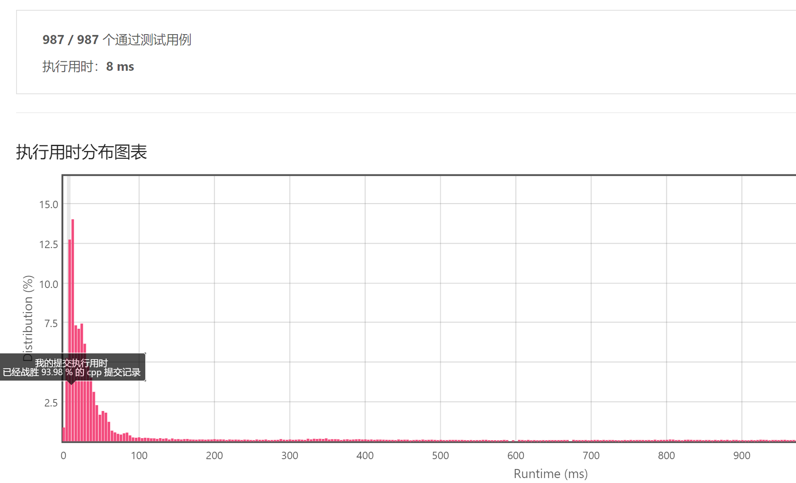
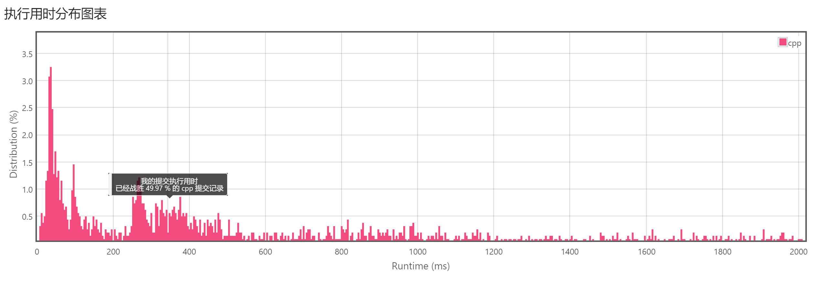
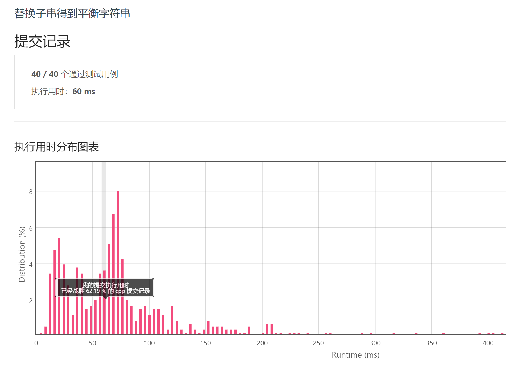

**1.无重复字符的最长子串**

```c++
class Solution {
public:
    int lengthOfLongestSubstring(string s) {
        int start = 0 , end = 0, result = 0, length = 0;
        
        while(end < s.length()){
            char tmp = s[end];
            for(int i = start; i < end; i++){
                if(tmp == s[i]){
                    start = i + 1;
                    length = end - start;
                    break;
                }
            }
            
            end++;
            length++;
            result = max(result,length);
        }
        return result;
    }
};
```



**2.串联所有单词的子串**

```c++
class Solution {
public:
    vector<int> findSubstring(string s, vector<string>& words) {
        if (s.empty() || words.empty()) return {};
        vector<int> res;
        int n = words.size(), len = words[0].size();
        unordered_map<string, int> wordCnt;
        for (auto &word : words) ++wordCnt[word];
        for (int i = 0; i <= (int)s.size() - n * len; ++i) {
            unordered_map<string, int> strCnt;
            int j = 0; 
            for (j = 0; j < n; ++j) {
                string t = s.substr(i + j * len, len);
                if (!wordCnt.count(t)) break;
                ++strCnt[t];
                if (strCnt[t] > wordCnt[t]) break;
            }
            if (j == n) res.push_back(i);
        }
        return res;
    }
};
```



**3.替换子串得到平衡字符串**

```c++
class Solution {
public:
    int balancedString(string s) {
        vector<char> chars{'Q', 'W', 'E', 'R'};
        unordered_map<char,int> cnt;
        for(char ch:s)
            ++cnt[ch];
        int expection=s.size()/4;   
        bool balance=true;
        for(char ch:chars){
            if(cnt[ch]!=expection)
                balance=false;
            cnt[ch]-=expection; 
        }
        if(balance==true)           
            return 0;
        
        int left=0,right=0,n=s.size(),ans=n;    
        while(left<=right&&right<n){
            --cnt[s[right]];
            bool find=true;         
            while(find){            
                for(char ch:chars){ 
                   if(cnt[ch]>0){   
                       find=false;
                       break;
                   }      
                }  
                if(find==true){         
                    ans=min(ans,right-left+1);
                    ++cnt[s[left++]];
                }
            }
            ++right;
        }
        return ans;
    }
};
```

